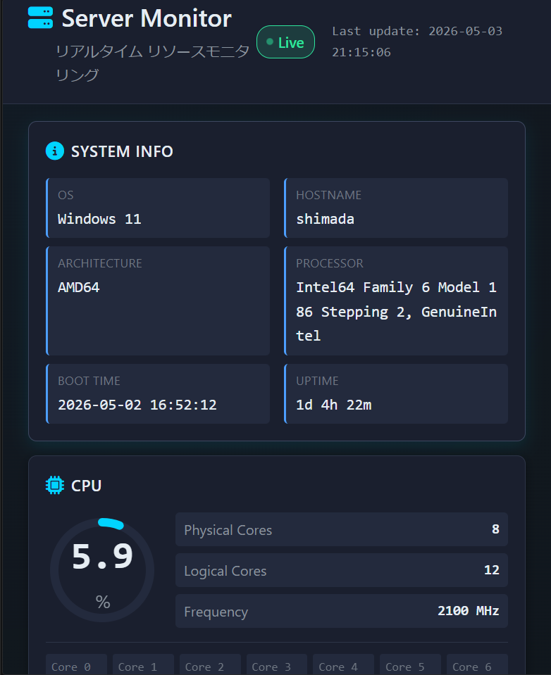

# サーバー監視ダッシュボード


[](https://github.com/ns7jp/server-monitor/actions/workflows/python-check.yml)

Python（Flask）+ psutil + Chart.js で構築した、**リアルタイムサーバー監視ダッシュボード**です。
ブラウザから動作中マシンのCPU・メモリ・ディスク・ネットワーク・プロセス情報を可視化します。

---

## 概要

インフラ運用・SRE業務での「サーバーの状態を一目で把握する」ニーズを想定して制作しました。
個人PCはもちろん、社内サーバーや自宅Linuxマシンに配置すれば、ブラウザだけで状態確認ができます。

### 主な機能

| 機能 | 概要 |
|------|------|
| 🖥 システム情報 | OS・ホスト名・アーキテクチャ・起動時刻・稼働時間 |
| ⚡ CPU使用率 | 全体使用率（円形ゲージ）＋コア別バー＋周波数情報 |
| 🧠 メモリ・スワップ | 使用率・使用量・空き容量・スワップ使用状況 |
| 💾 ディスク | 全パーティションの使用率（しきい値で色分け） |
| 🌐 ネットワークI/O | 累積送受信バイト・パケット数・**リアルタイム速度** |
| 📊 履歴グラフ | CPU/メモリの直近60秒推移（Chart.js折れ線） |
| 📋 プロセス一覧 | CPU使用率TOP15（PID・名前・ユーザー・CPU%・MEM%） |
| 🚨 しきい値色分け | 使用率に応じて緑→黄→橙→赤に自動変化 |
| 🔄 自動更新 | 統計：2秒ごと／プロセス：5秒ごと（fetch APIによる非同期取得） |

---

## スクリーンショット



ダークテーマ基調で、Grafana 等の運用ツールに似た雰囲気を意識したUIに仕上げています。CPU・メモリ・ディスクの使用率はしきい値（緑→黄→橙→赤）で自動配色されるため、異常時は一目で把握できます。

---

## 使い方

### 1. 必要なもの
- Python 3.9 以上
- pip

### 2. インストール

```bash
# プロジェクトをクローン or ダウンロード後
cd server-monitor

# 仮想環境（推奨）
python -m venv venv
# Windows
venv\Scripts\activate
# macOS / Linux
source venv/bin/activate

# 依存ライブラリをインストール
pip install -r requirements.txt
```

### 3. 起動

```bash
python app.py
```

起動後、ブラウザで以下にアクセス：

```
http://localhost:5000/
```

### 4. 動作確認・テスト

GitHub Actions では、Python の構文チェックと Flask API の簡単なテストを実行します。
ローカルで確認する場合は、開発用依存関係を入れてから `pytest` を実行します。

```bash
pip install -r requirements-dev.txt
python -m compileall .
pytest
```

このサンプルは学習用・ローカル確認用のため、初期設定では自分のPCからのみアクセスできる `127.0.0.1` で起動します。

LAN内の他端末から確認する場合は、`app.py` 末尾の `host` を `0.0.0.0` に変更し、`debug=False` のまま起動してください。

```
http://<PC のIPアドレス>:5000/
```

インターネット上へ直接公開する用途は想定していません。公開環境で使う場合は、認証、ファイアウォール、リバースプロキシ、本番用WSGIサーバーなどを別途設定してください。

---

## ファイル構成

```
server-monitor/
├── app.py                    # Flask アプリケーション本体
├── requirements.txt          # 依存ライブラリ一覧
├── README.md                 # このファイル
│
├── templates/
│   └── index.html            # ダッシュボード画面のHTMLテンプレート
│
└── static/
    ├── css/
    │   └── style.css         # ダークテーマのスタイル定義
    └── js/
        └── dashboard.js      # 自動更新・グラフ描画のクライアントロジック
```

---

## 技術スタック

| 分類 | 採用技術 | 役割 |
|------|---------|------|
| 言語 | Python 3.9+ | バックエンド |
| Webフレームワーク | Flask 3.0 | ルーティング・テンプレート描画・JSON API |
| システム情報取得 | psutil 5.9 | CPU・メモリ・ディスク・ネットワーク・プロセスの取得 |
| グラフ描画 | Chart.js 4.4 | CPU/メモリの時系列推移グラフ |
| アイコン | Font Awesome 6.5 | UIアイコン |
| 通信 | Fetch API | フロント→バックエンドの非同期通信 |

---

## アーキテクチャ

```
┌──────────────┐    HTTP fetch    ┌──────────────┐    psutil    ┌────────┐
│              │ ───────────────> │              │ ───────────> │   OS   │
│   Browser    │                  │  Flask app   │              │ kernel │
│ (dashboard)  │ <─────────────── │  (app.py)    │ <─────────── │        │
│              │   JSON response  │              │   metrics    └────────┘
└──────────────┘                  └──────────────┘
   Chart.js                          /api/stats
   DOM update                        /api/processes
```

- **2 秒ごと**：`/api/stats` を fetch → CPU/メモリ/ディスク/ネット/システム情報を更新
- **5 秒ごと**：`/api/processes` を fetch → プロセス一覧を更新
- 履歴グラフは過去30点（=60秒分）をローリング保持

---

## カスタマイズのヒント

### 更新間隔を変えたい
`static/js/dashboard.js` の冒頭を編集：

```javascript
const STATS_INTERVAL = 2000;     // 2秒 → 1000(1秒) や 5000(5秒)に変更可
const PROCESS_INTERVAL = 5000;   // プロセス取得間隔
const HISTORY_LENGTH = 30;       // グラフ保持点数
```

### しきい値（色変化のタイミング）を変えたい
`dashboard.js` の `getThresholdClass` を変更：

```javascript
function getThresholdClass(percent) {
    if (percent >= 90) return 'danger';
    if (percent >= 75) return 'alert';
    if (percent >= 50) return 'warn';
    return '';
}
```

### 外部からアクセスさせたい
初期設定は安全側に寄せて `host='127.0.0.1'`、`debug=False` にしています。
LAN内で確認する場合のみ `host='0.0.0.0'` に変更してください。
インターネット公開する場合は、Flask内蔵サーバーではなく **Nginx + Gunicorn** などで本番運用してください：

````markdown
```bash
gunicorn -w 4 -b 0.0.0.0:5000 app:app
```
### 本番運用する場合の参考設定
長時間運用するなら、Flask 内蔵サーバーではなく **Gunicorn + systemd** で常駐化、必要に応じて **Nginx** で前段にリバースプロキシを置くのが定番です。
#### Gunicorn での起動
```bash
pip install gunicorn
gunicorn -w 2 -b 127.0.0.1:5000 app:app
```
#### systemd ユニットファイル例（Linux）
`/etc/systemd/system/server-monitor.service`：
```ini
[Unit]
Description=Server Monitor Dashboard
After=network.target
[Service]
User=monitor
WorkingDirectory=/opt/server-monitor
ExecStart=/opt/server-monitor/venv/bin/gunicorn -w 2 -b 127.0.0.1:5000 app:app
Restart=on-failure
[Install]
WantedBy=multi-user.target
```
```bash
sudo systemctl enable --now server-monitor
sudo systemctl status server-monitor
```
#### Nginx リバースプロキシ設定例
```nginx
server {
    listen 80;
    server_name monitor.example.local;
    location / {
        proxy_pass http://127.0.0.1:5000;
        proxy_set_header Host $host;
        proxy_set_header X-Real-IP $remote_addr;
    }
}
```
⚠️ **注意**：本ツールは認証機能を持っていません。インターネット公開する場合は、Basic 認証や VPN・SSO 経由のアクセス制限を必ず併用してください。

---

## 学習ポイント

1. **psutil でクロスプラットフォームなシステム情報取得**
   - Windows / Linux / macOS で同じコードが動く
2. **Flask の JSON API 設計**
   - `jsonify()` で辞書をそのまま返す簡潔さ
3. **Fetch API + 非同期JSによるリアルタイム更新**
   - WebSocketを使わずポーリングで実装し、シンプルさを優先
4. **Chart.js による時系列グラフ**
   - ローリングウィンドウ方式で過去Nポイントだけ表示
5. **しきい値ベースの可視化**
   - 数値だけでなく色で「異常」を直感的に伝える設計

---

## 制作中のトラブルと解決過程

### 課題：CPU使用率が常に0%や100%で固定される
psutil の `cpu_percent()` を `interval=0` で呼ぶと、**前回呼び出しからの差分**を返す仕様。
初回呼び出し時は基準点がないため 0.0 が返る。

### 解決
最初の `cpu_percent` だけ `interval=0.5` を指定して0.5秒間サンプリング、
コア別の取得は直後に `interval=0` で取得することで、正確な値を取得しつつレスポンスを高速化。

````markdown
```python
cpu_percent = psutil.cpu_percent(interval=0.5)        # 全体（基準作り）
cpu_per_core = psutil.cpu_percent(interval=0, percpu=True)  # コア別（直後の差分）
```

トラブルシューティング（利用者向け）
実行時によくある問題と対処法をまとめました。

Q. pip install -r requirements.txt で失敗する
Python のバージョンが 3.9 未満の可能性があります。python --version で確認してください。
Windows で psutil のビルドエラーが出る場合は、Microsoft C++ Build Tools が必要です。
Q. python app.py で「Address already in use」と出る
ポート 5000 が他のアプリ（AirPlay、別の Flask アプリなど）に使われています。
app.py 末尾の port=5000 を 5050 などに変更して再起動してください。
Q. ブラウザで「サイトに接続できません」と表示される
ファイアウォールが Python を遮断していないか確認してください。
127.0.0.1:5000 でアクセスしているか確認してください。
Q. CPU やメモリの値が更新されない
ブラウザの開発者ツール（F12）→ Network タブで /api/stats が 200 を返しているか確認。
200 が返らない場合：Flask 側のターミナルにエラーが出ていないか確認。
Q. プロセス一覧が表示されない／少ない
macOS / Linux で他ユーザーのプロセスを表示したい場合は sudo python app.py で起動が必要です。
Windows は基本ユーザーで全プロセスにアクセス可。
Q. 別 PC からアクセスしたい
app.py 末尾の host='127.0.0.1' を host='0.0.0.0' に変更して再起動。
同 LAN 内の端末から http://<起動PCのIP>:5000/ でアクセス可能になります。
ファイアウォールでポート 5000 の受信許可が必要な場合があります。

---

## 想定する活用シーン

- **個人PC・自宅サーバーの常時モニタ**：別タブで開いておき、重い処理をしているときに確認
- **小規模Webサーバーの簡易監視**：Zabbix/Prometheus導入前の暫定モニタリング
- **学習用教材**：psutil・Flask・Chart.js・しきい値設計の実践サンプル
- **インフラ運用の入口**：監視ツール理解の第一歩として
- **障害対応の補助**：「いつから負荷が高いのか」をグラフでざっくり把握

---

## 今後追加したい機能（TODO）

- [ ] Basic 認証 or トークンベース認証の追加
- [ ] しきい値超過時のメール／Slack通知
- [ ] 履歴データの SQLite 永続化（再起動後も振り返れる）
- [ ] Docker イメージ化と docker-compose.yml の提供
- [ ] 複数サーバーのリモート集約（エージェント方式）
- [ ] PWA 化してスマホからも開きやすく

学習を進めながら順次追加予定です。

---

## ライセンス

MIT License

## 作者

**島田則幸（Noriyuki Shimada）**

- 📧 net7jp@gmail.com
- 📂 [GitHub @ns7jp](https://github.com/ns7jp)
